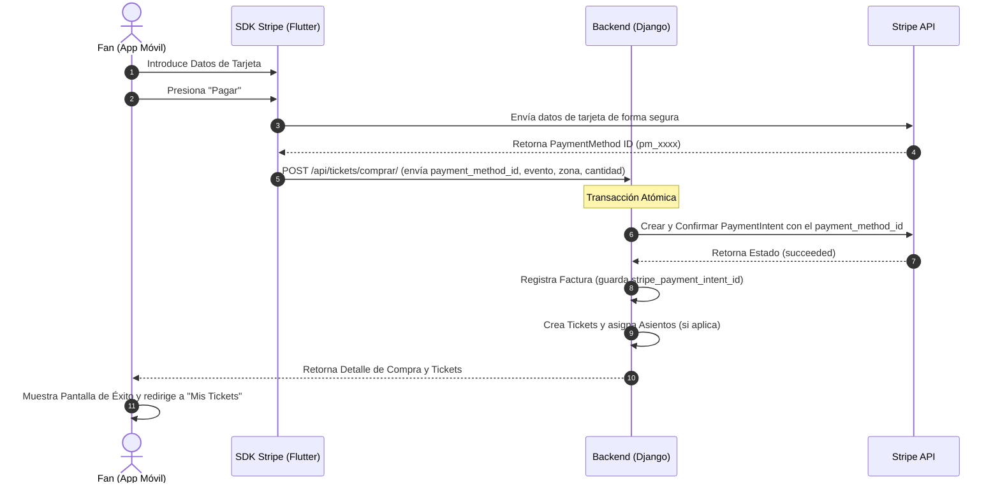

# Integración de Stripe (Modo de Prueba / Académico)

Este documento detalla el funcionamiento, arquitectura y pasos de configuración para la pasarela de pagos **Stripe** integrada en **MisterTicket**. La implementación se ha diseñado bajo un enfoque académico y seguro para simular transacciones reales.

---

## 1. ¿Cómo obtener las claves de prueba de Stripe?

Para que el sistema de pagos funcione localmente, necesitas obtener tus propias claves de prueba. Sigue estos pasos para configurarlas:

1. **Crear una cuenta en Stripe:**
   - Ve a [https://dashboard.stripe.com](https://dashboard.stripe.com) y regístrate para obtener una cuenta gratuita.
   - No es necesario verificar tu identidad ni añadir información bancaria real para usar el **Modo de Prueba (Test Mode)**.

2. **Activar el Modo de Prueba:**
   - Una vez en el Dashboard de Stripe, asegúrate de que el interruptor **"Test mode"** (en la esquina superior derecha o en el menú lateral) esté activado.

3. **Obtener las Claves API:**
   - Ve a la sección **Developers** (Desarrolladores) > **API keys** (Claves API).
   - Copia las siguientes claves:
     - **Publishable key** (Clave pública): Empieza por `pk_test_...`
     - **Secret key** (Clave secreta): Empieza por `sk_test_...` (haz clic en "Reveal test key" para verla).

4. **Configurar el Archivo `.env` del Backend:**
   - Abre el archivo `backend/.env` y añade las variables con tus claves:
     ```env
     STRIPE_SECRET_KEY=sk_test_tu_clave_secreta_aqui
     STRIPE_PUBLISHABLE_KEY=pk_test_tu_clave_publica_aqui
     ```

5. **Configurar Flutter:**
   - La clave pública (`pk_test_...`) se debe colocar en la inicialización de la app móvil Flutter (en `lib/main.dart`).

---

## 2. Flujo de Arquitectura del Pago

El flujo de pago está estructurado siguiendo las mejores prácticas de Stripe para evitar que los datos sensibles de la tarjeta pasen por nuestro servidor propio (cumpliendo con la normativa PCI-DSS):



---

## 3. Tarjetas de Prueba oficiales de Stripe

Para simular transacciones, puedes usar los siguientes números de tarjeta en el formulario de la app móvil. Puedes usar cualquier fecha de expiración en el futuro (ej. `12/30`) y cualquier código CVC de 3 dígitos (ej. `123`):

| Número de Tarjeta | Marca | Resultado Simulado |
| :--- | :--- | :--- |
| **`4242 4242 4242 4242`** | Visa | Pago Exitoso (Recomendado) |
| **`5555 5555 5555 4444`** | Mastercard | Pago Exitoso |
| **`4000 0027 6000 3184`** | Visa | Error: Tarjeta declinada por fondos insuficientes |
| **`4242 4242 4242 4040`** | Visa | Error: Tarjeta expirada |

---

## 4. Endpoints del Backend Involucrados

- **`GET /api/eventos/eventos/{id}/zonas-disponibles/`**: Obtiene las zonas asociadas a un evento, sus precios y cantidad de entradas disponibles.
- **`POST /api/tickets/comprar/`**: Endpoint transaccional que recibe el `payment_method_id` y procesa la compra.
- **`GET /api/tickets/tickets/mis-tickets/`**: Devuelve el listado de todos los tickets pertenecientes al usuario autenticado.
